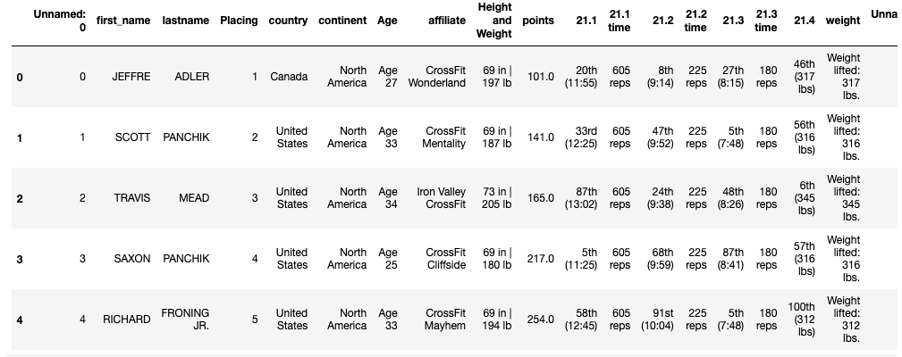
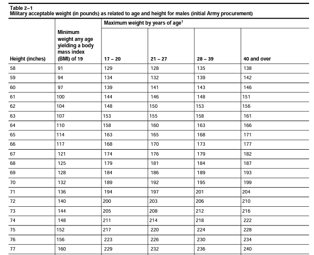
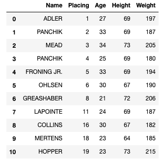
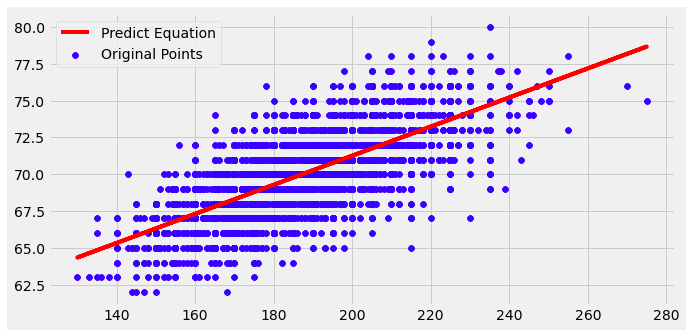

# 'Tipping the Scale' ~ Army Height and Weight Standards vs. The New Army Combat Fitness Test. 
#  An Analysis By: James Gamarra <ul><em> Data Set: 2021 Mens CrossFit Open Results</em></ul> 
<h2>Introduction:</h2>
    <ul>
 The Army Combat Fitness Test (ACFT), began development in 2013. This was in response to the growing need for a physical assessment that incorporated the demands of the modern Army. The previous physical assessment, Army Physical Fitness Test (APFT), was implemented in 1980 and composed of 3 events.

    

    <li>
    Push - Ups
    </li>
    <li>
    Sit - Ups 
    </li>
    <li>
    2 - Mile Run
    </li>

    
The new ACFT is composed of 6 events.

    
<li>
    3 Repetition Maximum Deadlift
    </li>
    <li>
    Standing Power Throw 
    </li>
    <li>
    Hand-Release Push-up
    </li>
    <li>Sprint- Drag-Carry</li>
    <li>Leg Tuck or Plank</li>
    <li>2 Mile Run</li>
    

    
These events are derived from the Army's '113 Warrior Tasks and Drills' and closely resemble a Cross-Fit workout. While the Army has effectively changed the way soliders workout. The scale in which we monitor the effects of this level of fitness have not been altered.

    
Through analysis, my aim is to observe any dissonance between the Height and Weight standards from the APFT era and the new ACFT era by examining a data set of the world's best crossfit athletes.

    </ul>

<h3>Data Set: <em>2021 Mens CrossFit Open Results</em></h3>
<ul>
    <li>
    Columns(19): first_name, lastname, Placing, country, continent, affiliate, Height and Weight, points, 21.1, 21.1 time, 21.2, 21.2 time, 21.3, 21.3 time, 21.4, weight, Unnamed: 18, Unnamed: 0.   
    </li>
    <li>
    1 Float, 1 Integer, 17 Objects.
    </li>
    <li>
    137,464 Entries
    </li>
    <li>
    2021 Results.
    </li>
    <li>
    Data Set contains multiple Nan’s.
    </li>
    
</ul>
<h3>Data Set Constraints:</h3>
<li>Globally Accumulated
    <ul>
        <li>Data is composed of multiple continents with uses of varying metric systems.</li>
    </ul>
</li>
<li>
    Multiple Nan's, Typos, and data unecessary for analysis.
</li>
<li>
    Only Males in Data Set.
</li>
<h2> Part 1:<em> Current Height and Weight Standards</em>
</h2>

I began my analysis by examining the current standards in place. The current Height and Wieght standards are outlined in the Army Regulation 40-501. A healthy weight is evaluated in four age groups.

    <li>17 - 20</li>
    <li>21 - 27</li>
    <li>28 - 39</li>
    <li>40 and Over</li>

Within each age group, a solidiers maximum allowed weight is correlated to their height(in inches).

I cleaned my data frame to fit the model in which the army makes its evaluations.
<ul>
1. All heights were converted to inches.
</ul>
<ul>
2. The data frame was grouped by age.
</ul>
<ul>
3. Ommitted all data incorrectly inputted and outstanding outliers to ensure data accuracy.
</ul>
<ul>
4. Only included the top 20% of Athletes to ensure the quality of the Athlete. 
</ul>

Once cleaned my data frame had a remaining 28,355 entries.

<h2> Part 2:<em> Regressional Analysis</em>
</h2>

Once my data was cleaned and prepared for analysis. I utlized a Linear Regression to predict the weight of a high performing athletes in 3 age groups. 

Coefficients
<ul>
1. Height
</ul>
<ul>
2. Weight
</ul> 

All Age Regression. 

Things to note:
<ul>
- While there is an obvious correlation between Height and Weight. The taller an individual the heavier he is.
</ul>
<ul>
 - The R-squared value only yields a value of .466. This tells me that the strength of my model is not much more conclusive than a straight line composed of averages. 
</ul>

<h2><em> Conclusion</em></h2>

Further analysis is needed for conlusive evidence suggesting a new maximum weight for soliders based on age group and height. While trends indicate the maximum weight should be increased, further analysis is necessary.

<h1><em> References</em></h1>
<li>
https://www.kaggle.com/branchmanager/2021-mens-crossfit-open-results-cleaned
</li>
<li>
chrome-extension://efaidnbmnnnibpcajpcglclefindmkaj/viewer.html?pdfurl=https%3A%2F%2Fwww.calculator.net%2Fpdf%2Fr40_501.pdf&clen=770607&chunk=true
</li>

